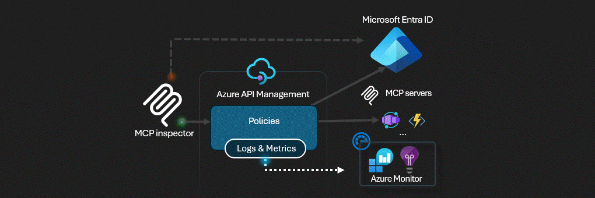

# AI Agents with Azure Kubernetes Service, Kaito, and APIM



Build powerful AI agents using **Azure Foundry models** deployed on Kubernetes with the **Model Context Protocol (MCP)**. This solution uses **Azure Kubernetes Service (AKS)**, **Kaito** for simplified LLM deployment, and **Azure API Management (APIM)** as an intelligent AI Gateway.

## 🎯 What This Solution Provides

- **🤖 AI Agent Backend**: Deploy MCP servers that AI agents can interact with
- **📦 Azure Foundry Models**: Run enterprise-grade LLMs from Azure Foundry on Kubernetes
- **⚡ Kaito Framework**: Automated model deployment and scaling on AKS with GPU support
- **🔧 Custom Tools**: Extensible MCP tools for AI agents (snippet storage, secrets management, approvals)
- **🛡️ Enterprise Security**: APIM gateway with OAuth, Workload Identity Federation, and Key Vault
- **📊 Production Ready**: OpenTelemetry observability, distributed tracing, and auto-scaling
- **👥 Human-in-the-Loop**: Agent365 approval workflow for sensitive operations
- **🔐 Zero Trust**: Workload Identity, managed identities, RBAC - no embedded secrets

## 🏗️ Architecture

```
AI Agent (Claude Desktop, etc.)
    ↓
Azure API Management (OAuth + Gateway)
    ↓
AKS Cluster (Workload Identity)
    ├── MCP Server (FastAPI + OpenTelemetry)
    │   ├── Tools: hello_mcp, save_snippet, get_snippet
    │   ├── Key Vault: get_secret, set_secret
    │   └── Agent365: request_approval, check_approval_status
    └── Kaito Workspace
        └── Azure Foundry Model (Phi-3, etc.)
            └── GPU Node Pool (NC-series VMs)
    
Azure Services (Managed Identity Access)
    ├── Key Vault (Secrets)
    ├── Storage Account (Blobs & Queues)
    ├── Application Insights (Telemetry)
    └── Log Analytics (Sentinel)
```

### Key Components

1. **AKS Cluster**: Kubernetes cluster with GPU-enabled node pools for model inference
2. **Kaito Operator**: Simplifies deploying and managing LLMs on Kubernetes
3. **MCP Server**: FastAPI application implementing Model Context Protocol
4. **Azure Foundry Models**: Enterprise LLMs (Phi-3, Llama, etc.) containerized and ready to deploy
5. **APIM**: Handles authentication, rate limiting, and API gateway functions
6. **Azure Storage**: Persistent storage for agent data (snippets, documents, etc.)
7. **Azure Key Vault**: Secure secrets management with RBAC access control
8. **Application Insights**: Distributed tracing and observability with OpenTelemetry
9. **Log Analytics**: Centralized logging with Microsoft Sentinel integration
10. **Workload Identity**: Passwordless authentication via Azure Entra ID federation

### Available MCP Tools

| Tool | Description | Parameters |
|------|-------------|------------|
| `hello_mcp` | Simple test tool | None |
| `save_snippet` | Save text/code snippets to Azure Storage | `snippetname`, `snippet` |
| `get_snippet` | Retrieve saved snippets | `snippetname` |
| `get_secret` | Retrieve secrets from Key Vault | `secret_name` |
| `set_secret` | Store secrets in Key Vault | `secret_name`, `secret_value` |
| `request_approval` | Agent365: Request human approval | `action`, `context`, `requester` |
| `check_approval_status` | Agent365: Check approval status | `approval_id` |

## 🚀 Quick Start

### Prerequisites

- Azure subscription
- [Azure CLI](https://learn.microsoft.com/cli/azure/install-azure-cli) installed
- [Azure Developer CLI (azd)](https://learn.microsoft.com/azure/developer/azure-developer-cli/install-azd) installed
- [Docker](https://docs.docker.com/get-docker/) installed
- [kubectl](https://kubernetes.io/docs/tasks/tools/) installed
- [Helm 3.x](https://helm.sh/docs/intro/install/) installed

### Step 1: Deploy Infrastructure

```bash
# Login to Azure
azd auth login
#az login --tenant 

# Deploy all Azure resources (AKS, ACR, APIM, Storage, etc.)
azd up
```

This command deploys:
- ✅ AKS cluster with GPU node pool
- ✅ Azure Container Registry
- ✅ Azure API Management
- ✅ Azure Storage account (blobs & queues)
- ✅ Azure Key Vault with RBAC
- ✅ Managed identities with Workload Identity
- ✅ Application Insights & Log Analytics
- ✅ Private endpoints (optional, with vnetEnabled)

**⏱️ Deployment time**: ~15-20 minutes

### Step 2: Connect to AKS

```bash
# Get cluster credentials
export AKS_CLUSTER_NAME=$(azd env get-values | grep AKS_CLUSTER_NAME | cut -d'=' -f2 | tr -d '"')
export RESOURCE_GROUP=$(azd env get-values | grep AZURE_RESOURCE_GROUP_NAME | cut -d'=' -f2 | tr -d '"')

az aks get-credentials --resource-group $RESOURCE_GROUP --name $AKS_CLUSTER_NAME
```

### Step 3: Install Kaito Operator

```bash
# Install Kaito on AKS
./scripts/install-kaito.sh

# Verify installation
kubectl get pods -n kaito-system
```

### Step 4: Build and Deploy MCP Server

```bash
# Set environment variables
export CONTAINER_REGISTRY=$(azd env get-values | grep CONTAINER_REGISTRY | cut -d'=' -f2 | tr -d '"')
export AZURE_STORAGE_ACCOUNT_URL=$(azd env get-values | grep AZURE_STORAGE_ACCOUNT_URL | cut -d'=' -f2 | tr -d '"')
export AZURE_CLIENT_ID=$(azd env get-values | grep MCP_SERVER_IDENTITY_CLIENT_ID | cut -d'=' -f2 | tr -d '"')

# Build and push Docker image
./scripts/build-and-push.sh

# Deploy to Kubernetes
export IMAGE_TAG=latest
envsubst < k8s/mcp-server-deployment.yaml | kubectl apply -f -
```

### Step 5: Deploy Azure Foundry Model

```bash
# Deploy Phi-3 model using Kaito
kubectl apply -f k8s/kaito-foundry-workspace.yaml

# Wait for model to be ready (5-10 minutes)
kubectl wait --for=condition=Ready workspace/azure-foundry-model --timeout=15m

# Check status
kubectl get workspace
```

### Step 6: Test Your Setup

```bash
# Run tests
python tests/test_mcp_fixed_session.py

# Or use MCP Inspector
npx @modelcontextprotocol/inspector
```

## 🔧 Configuration

### Using Different Azure Foundry Models

Edit `k8s/kaito-foundry-workspace.yaml`:

```yaml
spec:
  inference:
    preset:
      name: phi-3-mini-128k-instruct  # Change model here
  resource:
    instanceType: Standard_NC6s_v3  # Adjust VM size for larger models
```

Supported models:
- `phi-3-mini-4k-instruct` (recommended for testing)
- `phi-3-mini-128k-instruct`
- `phi-3-medium`
- Other Azure Foundry models

### Custom MCP Tools

Add new tools in `src/mcp_server.py`:

```python
TOOLS.append(
    MCPTool(
        name="my_tool",
        description="What this tool does",
        inputSchema={
            "type": "object",
            "properties": {
                "param1": {"type": "string", "description": "..."}
            },
            "required": ["param1"]
        }
    )
)

# Implement in execute_tool()
async def execute_tool(tool_name: str, arguments: Dict[str, Any]):
    if tool_name == "my_tool":
        # Your implementation
        return MCPToolResult(content=[{"type": "text", "text": "Result"}])
```  


## 🧪 Testing

### Automated Tests

```bash
# Run MCP server tests
python tests/test_mcp_fixed_session.py

# Test Kaito deployment
kubectl get workspace
kubectl describe workspace azure-foundry-model
```

### Manual Testing with MCP Inspector

```bash
npx @modelcontextprotocol/inspector
```

In MCP Inspector:
1. Set transport to **SSE**
2. Enter: `https://<your-apim>.azure-api.net/mcp/sse`
3. Add Authorization header
4. Click **Connect** → **List Tools**

## 📊 Monitoring

```bash
# MCP server logs
kubectl logs -n mcp-server -l app=mcp-server --follow

# Kaito operator logs
kubectl logs -n kaito-system -l app=kaito --follow

# Model logs
kubectl logs -l kaito.sh/workspace=azure-foundry-model
```

## 🛠️ Troubleshooting

### AKS Issues

```bash
# Check nodes
kubectl get nodes

# Check GPU availability
kubectl describe node -l workload=gpu
```

### Kaito Issues

```bash
# Check Kaito status
kubectl get pods -n kaito-system

# Check workspace
kubectl describe workspace azure-foundry-model

# Scale GPU nodes manually if needed
az aks nodepool scale --resource-group $RESOURCE_GROUP \
  --cluster-name $AKS_CLUSTER_NAME --name gpupool --node-count 1
```

### MCP Server Issues

```bash
# Check pods
kubectl get pods -n mcp-server

# View logs
kubectl logs -n mcp-server -l app=mcp-server

# Restart deployment
kubectl rollout restart deployment/mcp-server -n mcp-server
```

## 💰 Cost Optimization

### Auto-Scale GPU to Zero

GPU nodes scale to 0 when idle (configured by default):

```yaml
# In kaito-foundry-workspace.yaml
spec:
  resource:
    count: 0  # Scales to zero when not in use
```

### Use Spot Instances

Edit `infra/core/aks/aks-cluster.bicep` to use spot VMs (70-90% cost reduction):

```bicep
scaleSetPriority: 'Spot'
scaleSetEvictionPolicy: 'Delete'
spotMaxPrice: -1  # Pay up to regular price
```

## 🔐 Security

- **Authentication**: OAuth 2.0 via Azure Entra ID
- **Workload Identity**: Passwordless pod-level authentication via OIDC federation
- **Key Vault**: Centralized secrets management with RBAC and audit logs
- **Network**: Optional VNet isolation with private endpoints
- **RBAC**: Kubernetes and Azure RBAC enabled
- **Zero Trust**: No connection strings, access keys, or certificates in configuration

## 🚀 Advanced Features

### Workload Identity Federation

Run the demo to see how pods obtain Azure tokens without embedded secrets:

```bash
./scripts/demo-workload-identity.sh
```

This demonstrates:
- ✅ AKS pod obtains Entra token via OIDC federation
- ✅ Access to Key Vault without connection strings
- ✅ Access to Storage without access keys
- ✅ Full audit trail in Azure AD logs

**Documentation**: [docs/WORKLOAD_IDENTITY_DEMO.md](docs/WORKLOAD_IDENTITY_DEMO.md)

### Azure Key Vault Integration

Store and retrieve secrets securely:

```python
# Via MCP tools
{
  "method": "tools/call",
  "params": {
    "name": "set_secret",
    "arguments": {
      "secret_name": "my-api-key",
      "secret_value": "super-secret"
    }
  }
}
```

Features:
- RBAC-based access control
- Soft delete and purge protection
- Private endpoints for network isolation
- Full audit logging to Log Analytics

**Documentation**: [docs/KEY_VAULT_INTEGRATION.md](docs/KEY_VAULT_INTEGRATION.md)

### Observability with OpenTelemetry

End-to-end distributed tracing across APIM → MCP → Foundry:

```kusto
// Query correlated traces in Application Insights
requests
| where url contains "mcp/message"
| join kind=inner (dependencies) on operation_Id
| project timestamp, name, duration, dependency_Name
```

Features:
- Distributed tracing with W3C Trace Context
- Custom metrics for tool executions
- Structured logging with trace correlation
- Automatic instrumentation of FastAPI
- Microsoft Sentinel integration

**Documentation**: [docs/OBSERVABILITY.md](docs/OBSERVABILITY.md)

### Agent365: Human-in-the-Loop

Request human approval for sensitive operations:

```python
# Agent requests approval
approval_id = request_approval(
    action="Delete production data",
    context="GDPR compliance cleanup",
    requester="cleanup-agent"
)

# Poll for decision
status = check_approval_status(approval_id)
if status == "approved":
    execute_action()
```

Integration options:
- Microsoft Teams adaptive cards
- Power Automate flows
- Azure Static Web Apps dashboard
- Power Apps mobile interface

**Documentation**: [docs/AGENT365.md](docs/AGENT365.md)

## 🧪 Testing

### Test Key Vault Integration

```bash
# Set environment variables
export SERVICE_API_ENDPOINT=$(azd env get-values | grep SERVICE_API_ENDPOINTS | cut -d'=' -f2 | tr -d '"[]')
export MCP_ACCESS_TOKEN="your-mcp-token"

# Run tests
python tests/test_keyvault_integration.py
```

### Test Agent365 Workflow

```bash
python tests/test_agent365_workflow.py
```

### Test Observability

Check Application Insights for traces:

```bash
# Get Application Insights connection string
export APPINSIGHTS_CONNECTION=$(azd env get-values | grep APPLICATIONINSIGHTS_CONNECTION_STRING | cut -d'=' -f2 | tr -d '"')

# View recent traces
az monitor app-insights query \
  --app $APPINSIGHTS_CONNECTION \
  --analytics-query "traces | where timestamp > ago(1h) | order by timestamp desc"
```
- **Workload Identity**: Pod-level managed identities
- **Network**: Optional VNet isolation (`vnetEnabled=true`)
- **RBAC**: Kubernetes and Azure RBAC enabled

## 📚 Learn More

### Official Documentation
- [Kaito Project](https://github.com/kaito-project/kaito) - Kubernetes AI Toolchain Operator
- [Azure Kubernetes Service](https://learn.microsoft.com/azure/aks/)
- [Model Context Protocol](https://modelcontextprotocol.io/)
- [Azure Foundry](https://learn.microsoft.com/azure/ai-studio/)
- [Azure API Management](https://learn.microsoft.com/azure/api-management/)

### Advanced Topics
- [Workload Identity Federation](docs/WORKLOAD_IDENTITY_DEMO.md)
- [Key Vault Integration](docs/KEY_VAULT_INTEGRATION.md)
- [Observability with OpenTelemetry](docs/OBSERVABILITY.md)
- [Agent365 Human-in-the-Loop](docs/AGENT365.md)
- [System Architecture](docs/ARCHITECTURE.md)

## 🤝 Contributing

Contributions are welcome! See [CONTRIBUTING.md](CONTRIBUTING.md) for guidelines.

## 📄 License

This project is licensed under the MIT License - see [LICENSE.md](LICENSE.md).
